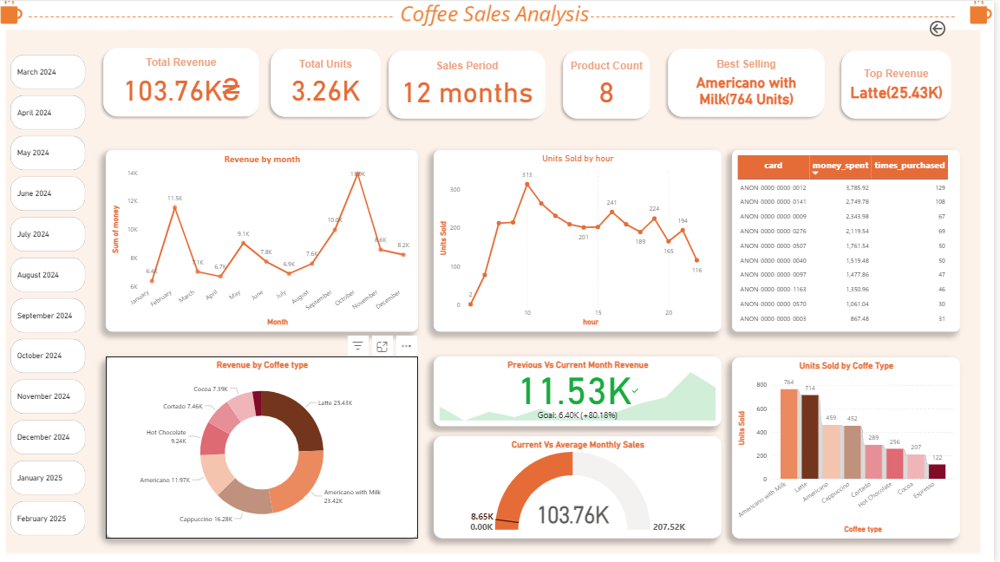

# Coffee Sales SQL Analysis 

## Table of Contents
- [Case Study](#case-study)
- [Dataset Description](#dataset-description)
- [Data Model](#data-model)
- [Data Cleaning](#data-cleaning)
- [Data Analysis](#data-analysis)
- [Dashboard](#dashboard)
- [Key Business Insights](#key-business-insights)
- [Tools Used](#tools-used)
  

## Case Study

A coffee shop wants to understand its sales performance, product demand, customer behavior (card users), and time-based trends to improve pricing, staffing, and payment strategy decisions.

This project treats the dataset as a real-world transactional system and answers practical business questions using SQL.

## Dataset Description

The dataset is a transaction-level coffee sales dataset sourced from Kaggle and stored as a CSV file.

Key Fields

- date – Transaction date

- datetime – Full timestamp of the transaction

- cash_type – Payment method (Cash / Card)

- card – Card identifier (null for cash payments)

- money – Revenue generated per transaction

- coffee_name – Coffee product sold

## Data Model

A single fact table representing coffee sales transactions, designed for:

- Date-based analysis

- Time-of-day analysis

- Product-level performance

- Payment method comparison

## Data Cleaning

Performed using MySQL:

- Split datetime into:

   1. date

   2. time

- Extracted hour from time for peak-hour analysis

- Standardized payment values in cash_type

- Handled null values in card for cash transactions

- Removed redundant columns after transformation

- Ensured numeric consistency for money

## Data Analysis
**Sales Analysis**

- Total revenue generated

- Average revenue per transaction

- Daily and monthly sales trends

- Revenue split by cash vs card payments

**Customer Insights (Card Users)**

- Top card users by total revenue

- Repeat purchase behavior using card identifiers

- Contribution of card users to overall revenue

**Product Insights**

- Best-selling coffee products by:

   1. Total revenue
   2. Transaction count

- Price change tracking over time

- Product performance vs average monthly sales

**Seasonality & Trends**

- Month-over-month revenue comparison

- Running totals to analyze sales growth

- Peak sales hours during the day

## Dashboard

The dashboard was built in Power BI using insights generated from MySQL queries.
Each business question answered in SQL was converted into summary tables and imported into Power BI for visualization.

**Dashboard Highlights**

- Total Revenue: 103.76K

- Total Units Sold: 3.26K

- Sales Period: 12 months

- Product Count: 8 coffee types

- Best-Selling Product (Units): Americano with Milk (764 units)

- Top Revenue Product: Latte (25.43K)

**Visual Insights**

1. Revenue Trend (Monthly)

 - Shows month-by-month revenue variation

 - Helps identify seasonality and peak months

2. Units Sold by Hour

 - Highlights peak sales hours during the day

 - Useful for staffing and operational planning

3. Revenue by Coffee Type

 - Compares revenue contribution of each product

 - Identifies high-value vs low-value items

4. Units Sold by Coffee Type

 - Focuses on demand volume rather than revenue

 - Helps differentiate popular vs premium products

5. Top Card Customers

 - Displays highest revenue-generating card users

 - Includes total spend and purchase frequency

6. Current vs Average Monthly Sales

 - Compares current performance against historical average

 - Indicates whether sales are above or below benchmark

7. Previous vs Current Month Revenue

 - Tracks short-term growth or decline

 - Useful for monthly performance monitoring

**Workflow**

1. Performed data cleaning and analysis in MySQL

2. Converted each SQL insight into aggregated tables

3. Imported tables into Power BI

4. Designed an interactive dashboard with:

5. Monthly slicers

6. KPI cards

7. Trend and comparison visuals

## Key Business Insights

- Certain coffee types consistently generate higher revenue

- Peak sales hours identified for operational planning

- Card payments show higher repeat usage

- Clear monthly seasonality patterns in sales

- Some products perform above average compared to monthly benchmarks

## Tools Used
- **MySQL** – Data cleaning, transformation, and analytical queries  
- **Power BI** – Data modeling and dashboard visualization  
- **CSV Dataset** – Coffee sales transactional data from Kaggle  
- **GitHub** – Version control and project documentation  

